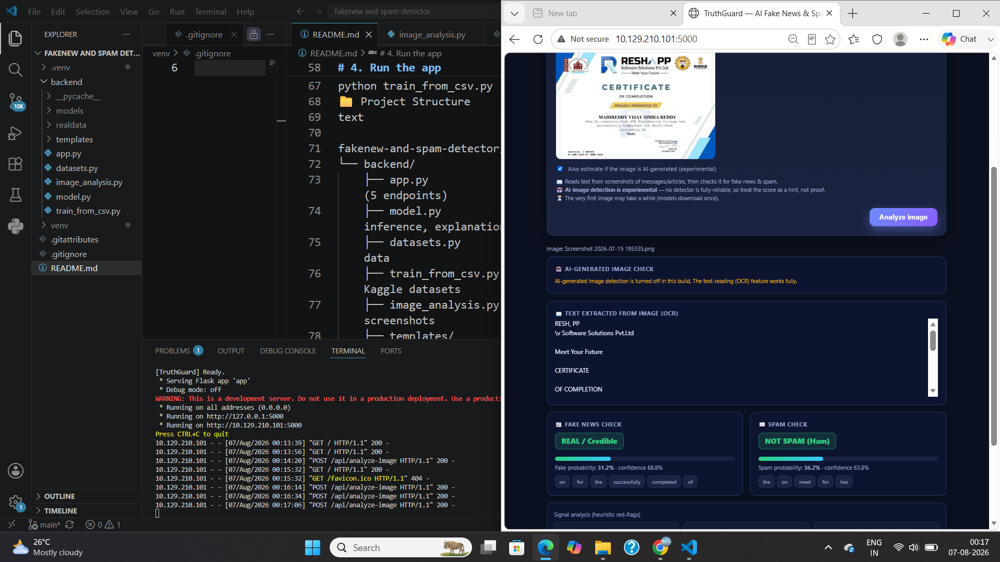

🛡️ TruthGuard — AI-Powered Fake News & Spam Detector
TruthGuard is a machine-learning web application that classifies text as fake vs. real news and spam vs. legitimate (ham) messages. It accepts input five different ways — typed text, .txt upload, batch .csv, a URL, or an image/screenshot (via OCR) — and returns a verdict with a confidence score and the keywords that drove the decision.
### 🔗 [Live Demo](https://truthguard-d1xv.onrender.com)

Both models are trained on real-world datasets (~50,000 examples) and achieve ~99% accuracy.

✨ Features
📰 Fake-news detection — flags unreliable / clickbait content vs. credible reporting
✉️ Spam detection — flags scam / phishing / promotional spam vs. normal messages
🔍 Explainable results — shows confidence % and the top words influencing each prediction
🚩 Signal analysis — heuristic red-flags (ALL-CAPS ratio, exclamation marks, links, money mentions)
🧾 Five input methods:
✍️ Type or paste text
📄 Upload a .txt file
📊 Batch-check a .csv (returns a downloadable results file)
🔗 Paste a URL (fetches and analyzes the article)
📷 Upload an image / screenshot (reads the text via Tesseract OCR, then classifies it)
📊 Model Performance
Model	Trained on	Accuracy	F1 Score
📰 Fake-news detector	~44,900 news articles	99.5%	0.995
✉️ Spam detector	~5,570 SMS messages	98.9%	0.959
Datasets: Fake and Real News Dataset and SMS Spam Collection (Kaggle).

🛠️ Tech Stack
Backend: Python, Flask
Machine Learning: scikit-learn (TF-IDF vectorizer + Logistic Regression)
OCR: Tesseract via pytesseract
Web scraping: requests + BeautifulSoup (for URL analysis)
Frontend: HTML, CSS, vanilla JavaScript (single-page, no framework)
🧠 How It Works
Each detector is a scikit-learn pipeline:

Text cleaning — normalizes URLs, long numbers, and punctuation.
TF-IDF vectorizer — converts text into weighted word/bigram features.
Logistic Regression — outputs a probability for each class.
Trained models are cached to disk (models/*.joblib) so the app starts instantly after the first run. The image feature runs the OCR-extracted text through the same models.

🚀 Getting Started
Prerequisites
Python 3.10+
(For the image feature) Tesseract OCR installed on your system
Installation
Bash

# 1. Clone the repo
git clone https://github.com/nikhileshwar-12/fakenew-and-spam-detector.git
cd "fakenew-and-spam-detector/backend"

# 2. (Recommended) create a virtual environment
python -m venv .venv
# Windows:
.venv\Scripts\activate
# macOS/Linux:
source .venv/bin/activate

# 3. Install dependencies
pip install flask scikit-learn pandas numpy joblib requests beautifulsoup4 pytesseract pillow

# 4. Run the app
python app.py
Open http://localhost:5000 in your browser.

Training on the full datasets (optional)
Download the two Kaggle datasets, place the CSVs in backend/realdata/, then run:

Bash

python train_from_csv.py
📁 Project Structure
text

fakenew-and-spam-detector/
└── backend/
    ├── app.py               # Flask server + REST API (5 endpoints)
    ├── model.py             # ML pipelines, training, inference, explanations
    ├── datasets.py          # built-in sample training data
    ├── train_from_csv.py    # trains models on real Kaggle datasets
    ├── image_analysis.py    # Tesseract OCR for images/screenshots
    ├── templates/
    │   └── index.html       # single-page UI
    ├── models/              # cached trained models (auto-generated)
    └── realdata/            # datasets (not committed — download from Kaggle)
🔌 API Endpoints
Method	Endpoint	Description
POST	/api/analyze	Analyze raw text (JSON)
POST	/api/analyze-file	Analyze an uploaded .txt file
POST	/api/analyze-csv	Batch-classify a .csv, returns results file
POST	/api/analyze-url	Fetch & analyze an article by URL
POST	/api/analyze-image	OCR an image, then classify the text
## 📸 Screenshots

⚠️ Disclaimer
TruthGuard is an educational project. Predictions are probabilistic and should not be the sole basis for real-world decisions about the credibility of news or messages.

👤 Author
Nikhileshwar — GitHub